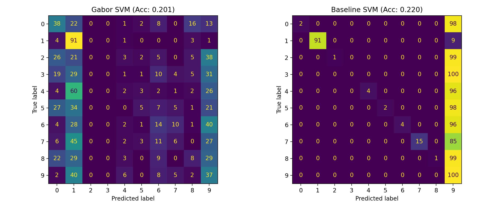

# MNIST Representation Learning — From Scratch and With PyTorch 🧠📊

This project is a **self-learning initiative** to explore how classical and modern machine learning methods perform on the MNIST digit classification task.  
I implemented everything from scratch using **NumPy** and compared it against **PyTorch** implementations, analyzing results through training/validation curves and feature visualizations.

---

## 🔍 Motivation
Instead of relying only on high-level frameworks, I wanted to understand:
- How a neural network actually performs **forward and backward passes** at the layer level.
- How **gradient checking** validates correctness of custom backprop implementations.
- The effect of different **feature representations** (raw pixels vs. Gabor filters).
- How a scratch-built pipeline compares to **PyTorch** in terms of stability and accuracy.

---


---

## 🛠️ Implementations

### 1. Feature Engineering + SVM
- Downsampled MNIST digits to $14\times14$ resolution.
- Built **Gabor filter banks** to extract orientation- and frequency-sensitive features.
- Trained **SVM classifiers** on:
  - Raw pixel inputs
  - Gabor-enhanced features
- Result: Gabor features improved accuracy and yielded more separable confusion matrices.

### 2. Neural Networks From Scratch (NumPy)
- Built custom layers:
  - **Embedding**: 28×28 → 7×7×8 patches
  - **Linear**: fully connected mapping
  - **ReLU** activation
  - **Softmax + Cross-Entropy** loss
- Verified each component with **gradient checking** (finite differences).
- Trained using minibatch SGD (batch=32, lr=0.1) for 10k updates.
- Observed ~40–60% accuracy with simple 1-layer architecture.

### 3. Neural Networks With PyTorch
- Reimplemented the same pipeline using `nn.Conv2d`, `nn.Linear`, `nn.ReLU`, and `nn.CrossEntropyLoss`.
- Trained for 10k updates with identical settings.
- Achieved smoother convergence, better stability, and higher final accuracy compared to NumPy model.

---

## 📊 Results

### SVM Experiments
- **Raw pixels**: struggled with invariances (rotation/scale).
- **Gabor features**: added robustness to orientation and frequency, improving classification.

### Neural Networks
- **NumPy model**:  
  - Showed correct learning behavior but limited by shallow architecture.  
  - Training error stabilized at ~0.4–0.6.
- **PyTorch model**:  
  - More stable training curves.  
  - Better validation error.  
  - Demonstrated advantages of optimized layers.

Results are visualized in the `outputs_p3i/` and `Support_Vector_Machine/` folders:

- Training loss/error curves (NumPy vs PyTorch)
- Validation loss/error curves
- Gabor filter visualizations
- Confusion matrices

---

## 📊 Results Preview

### Neural Network (NumPy vs PyTorch)

**Validation Loss (NumPy)**  


**Validation Error (NumPy)**  


**PyTorch Training Loss**  


**PyTorch Validation Error**  


---

### SVM with Gabor Filters

**Filter Bank (36 Gabor filters)**  


**Confusion Matrix: Baseline vs Gabor Features**  



## ⚙️ Setup

```bash
python3 -m venv venv
source venv/bin/activate
pip install -U numpy matplotlib torchvision torch tqdm scikit-learn
