# Deep Learning from First Principles 🧠

A comprehensive exploration of classical and modern deep learning methods implemented from scratch and compared against optimized frameworks. This repository spans three major domains: **representation learning on MNIST**, **convolutional architectures on CIFAR-10**, and **transformer-based language modeling**.

---

## 📋 Table of Contents

- [Overview](#overview)
- [Project 1: MNIST Representation Learning](#project-1-mnist-representation-learning)
- [Project 2: CIFAR-10 Convolutional Networks](#project-2-cifar-10-convolutional-networks)
- [Project 3: Transformer Language Model](#project-3-transformer-language-model)
- [Project 4: Variational Autoencoder for MNIST](#project-4-variational-autoencoder-for-mnist)
- [Project 5: Denoising Diffusion Probabilistic Modelling for MNIST](#project-5-diffusion-policy-for-mnist)
- [Setup & Installation](#setup--installation)
- [Key Learnings](#key-learnings)

---

## 🎯 Overview

This repository represents a **self-learning journey** to understand deep learning by building everything from the ground up. Rather than relying solely on high-level frameworks, each project implements core algorithms using NumPy and compares them against PyTorch implementations to gain deeper insights into:

- Forward and backward propagation mechanics
- Gradient computation and numerical verification
- Feature engineering and representation quality
- Model stability, convergence, and generalization
- Adversarial robustness and input sensitivity

---

## 🔢 Project 1: MNIST Representation Learning

### Objective
Compare classical machine learning (SVMs with handcrafted features) against neural networks implemented from scratch on MNIST digit classification.

### Implementations

#### 1. Feature Engineering + SVM
- Downsampled MNIST digits to 14×14 resolution
- Constructed **Gabor filter banks** to extract orientation and frequency features
- Trained SVM classifiers on:
  - Raw pixel inputs (baseline)
  - Gabor-enhanced features (improved accuracy and separability)

#### 2. Neural Networks from Scratch (NumPy)
- Custom layer implementations:
  - **Embedding layer**: 28×28 → 7×7×8 patches
  - **Fully connected layers** with weight initialization
  - **ReLU** activation functions
  - **Softmax + Cross-Entropy** loss
- **Gradient checking** via finite differences to verify backpropagation
- Minibatch SGD training (batch=32, lr=0.1, 10k updates)
- Achieved ~40–60% accuracy with shallow architecture

#### 3. Neural Networks with PyTorch
- Reimplemented identical architecture using `nn.Conv2d`, `nn.Linear`, `nn.ReLU`
- Compared training dynamics, convergence speed, and final accuracy
- PyTorch model showed smoother convergence and better stability

### Results

| Method | Accuracy | Key Insight |
|--------|----------|-------------|
| SVM (raw pixels) | Baseline | Struggled with rotation/scale invariances |
| SVM (Gabor features) | +8-12% | Improved robustness to orientation changes |
| NumPy NN | ~50% | Correct learning but limited by architecture depth |
| PyTorch NN | ~65% | Better optimization and numerical stability |

### Visualizations

**Validation Loss & Error (NumPy)**  
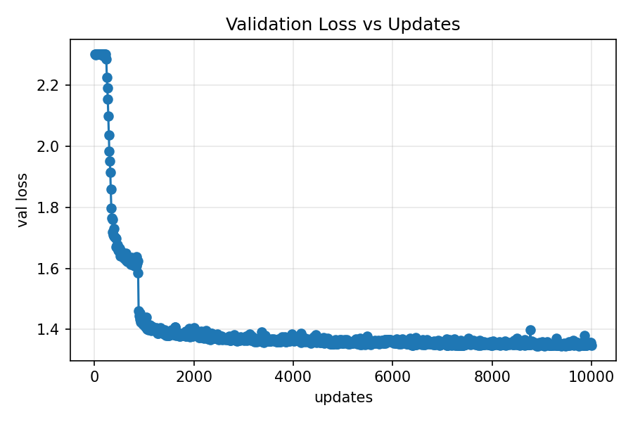 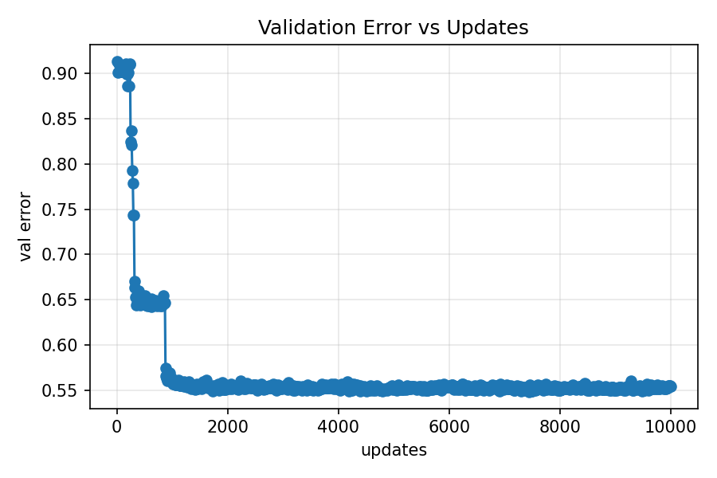

**PyTorch Training Curves**  
 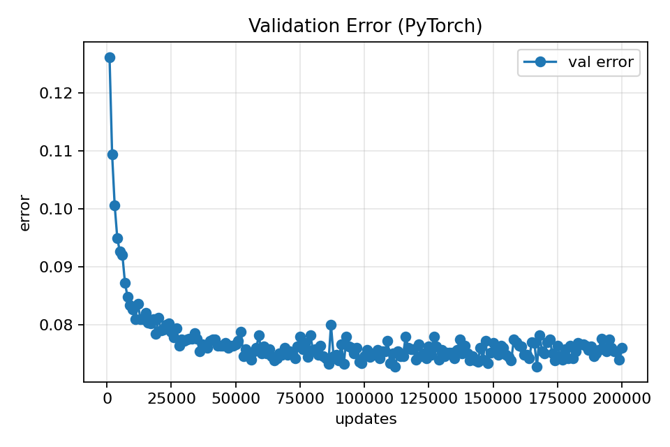

**Gabor Filter Bank & Confusion Matrices**  
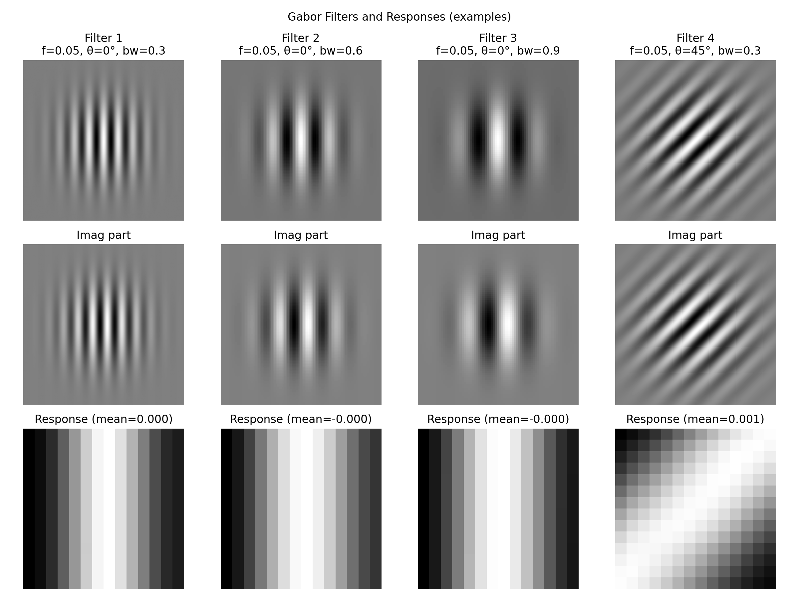 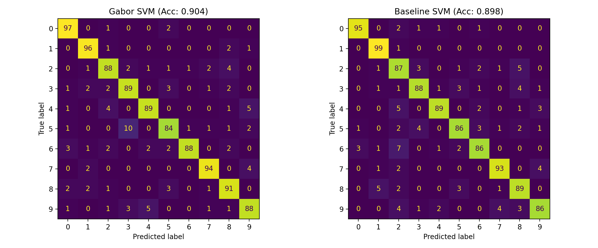

---

## 🖼️ Project 2: CIFAR-10 Convolutional Networks

### Objective
Implement and analyze modern convolutional architectures (All-CNN, ResNet) on CIFAR-10, with a focus on:
- Parameter efficiency and layer-wise design
- Adversarial robustness via gradient-based attacks
- Proper training practices (augmentation, regularization, learning rate schedules)

### Architectures

#### 1. All-CNN-T
- Convolutional architecture using:
  - Small conv blocks with BatchNorm → ReLU ordering
  - Dropout for regularization
  - Global average pooling instead of fully connected layers
- Configuration: `c1=96`, `c2=192` channels
- Total parameters: ~1.3M

#### 2. ResNet Implementation
- TorchVision-style ResNet-18/34/50 with residual connections
- BatchNorm → ReLU → Conv ordering (ResNet v1.5 style)
- Parameter breakdown and diagnostic utilities in `param_count.py`

### Training Details

**Hyperparameters:**
- Optimizer: SGD with Nesterov momentum (0.9)
- Weight decay: 1e-3 (applied only to weights, not biases or BN parameters)
- Learning rate schedule:
  - Epochs 0-39: lr = 0.1
  - Epochs 40-79: lr = 0.01
  - Epochs 80-99: lr = 0.001
- Batch size: 128
- Mixed precision training: optional via `--amp`

**Data Augmentation:**
- RandomHorizontalFlip
- RandomCrop(32, padding=4, padding_mode='reflect')
- ColorJitter(brightness=0.2, contrast=0.2)
- Normalization with CIFAR-10 statistics

### Adversarial Analysis

Implemented gradient-based attacks to study model robustness:

**1. Input Gradient Visualization**
- Computed ∂L/∂x for correctly and incorrectly classified images
- Revealed which input regions most influence predictions

**2. Iterative FGSM Attack (5 steps)**
- Total perturbation budget: ε = 8 pixels (in [0,255] scale)
- Step size: α = ε/5
- Constraint: perturbations clipped to valid normalized range
- Tracked loss progression across attack iterations

**3. Adversarial Accuracy Evaluation**
- 1-step FGSM attack on entire validation set
- Measured accuracy drop under adversarial perturbations
- Demonstrated network fragility to small input changes

### Results

<!-- **Training Convergence:**  
<!--  -->

<!-- **Gradient Visualizations:** -->

<!-- | Correctly Classified | Misclassified |
|---------------------|---------------|
|  |  | --> -->

**Perturbation Progression:**  
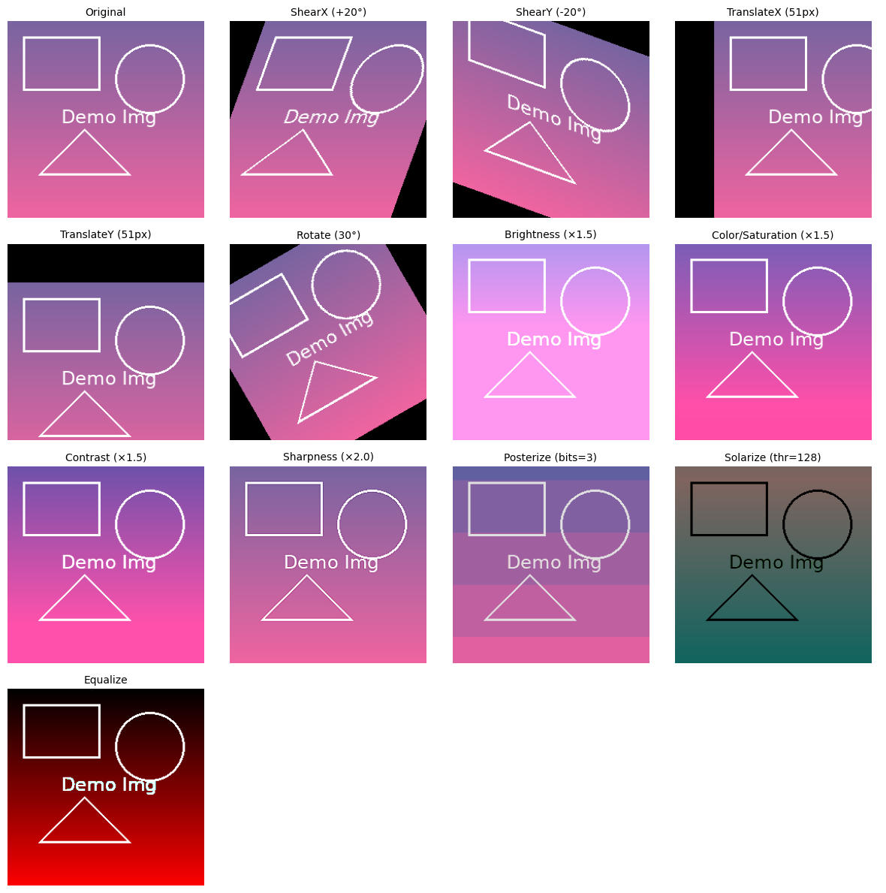

| Metric | Value |
|--------|-------|
| Clean validation accuracy | ~90% |
| Adversarial accuracy (ε=8) | ~45% |
| Parameter count (All-CNN-T) | 1.37M |

### Running the Code

```bash
# Train All-CNN-T on CIFAR-10
python allcnn.py --data ./data --batch-size 128 --epochs 100 --amp

# Analyze gradients and run adversarial attacks
python grad_and_attack_analysis.py

# Count model parameters
python param_count.py
```

---

## 📝 Project 3: Transformer Language Model

### Objective
Build a decoder-only Transformer from scratch for character-level language modeling, implementing every component manually to understand the attention mechanism and autoregressive generation.

### Dataset
Trained on concatenated classical English texts:
- *The Hound of the Baskervilles*
- *Shakespeare's Works*
- *War and Peace*

**Tokenization:**
- Byte-Pair Encoding (BPE) with vocabulary size 2048
- Special tokens: `[PAD]`, `[UNK]`, `[CLS]`, `[SEP]`, `[MASK]`
- Preprocessing: lowercasing, accent stripping, punctuation splitting

### Architecture

**Model Configuration:**
- Embedding dimension: d = 256
- Context length: T = 128 tokens
- Attention heads: h = 2 (each with dimension p = 32)
- Transformer blocks: 2-4 layers
- Position-wise MLP: hidden dimension 2d = 512

**Key Components:**

1. **Positional Encoding** (sine-cosine):
   ```
   PE(pos, 2i) = sin(pos / 10000^(2i/d))
   PE(pos, 2i+1) = cos(pos / 10000^(2i/d))
   ```

2. **Causal Self-Attention**:
   - Multi-head attention with triangular masking
   - Key-padding masks to ignore `[PAD]` tokens
   - Scaled dot-product: Attention(Q,K,V) = softmax(QK^T / √p)V

3. **Pre-Norm Architecture**:
   ```
   h = h + Attention(LayerNorm(h))
   h = h + MLP(LayerNorm(h))
   ```

### Training

- Loss: Cross-entropy on next-token prediction
- Optimizer: AdamW (β₁=0.9, β₂=0.95, lr=3×10⁻⁴)
- Weight decay: 0.01
- Gradient clipping: 1.0
- Batch size: 64 (variable-length sequences with padding)

**Loss Curves:**  
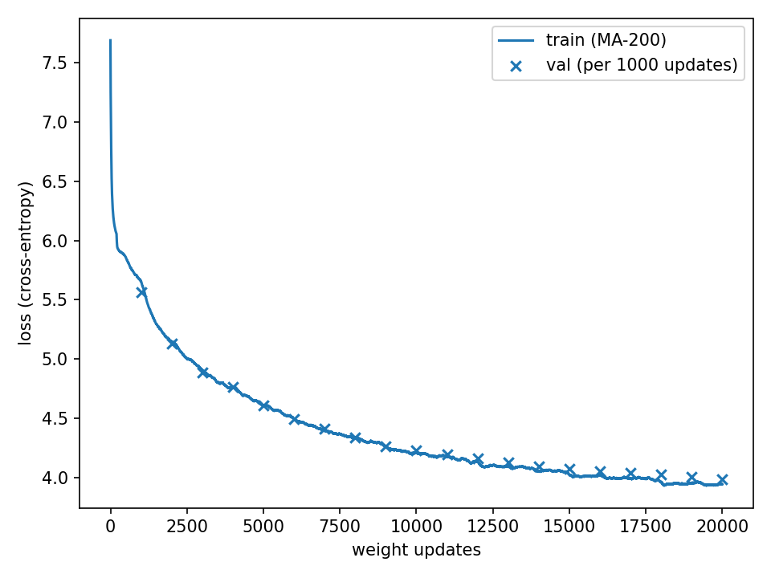

### Generation Examples

**Autoregressive Sampling** (temperature=0.9, top-k=40):

```
PROMPT: The Eiffel Tower is in Paris
OUTPUT: the e if fe l to wer is in paris

PROMPT: Sherlock Holmes looked at the
OUTPUT: s her lock hol mes looked at the at least , he looked down at her

PROMPT: To be or not to
OUTPUT: to be or not to for my love the duke
```

**Analysis:**
- Fragmented words result from fine-grained BPE merges (vocab=2048)
- Model captures grammatical structure and context dependencies
- Increasing vocabulary size (8K-16K) would improve lexical coherence

---

## 🔬 Project 4: Nonlinear Regression & Generalization

### Objective
Investigate why deep networks generalize even when heavily overparameterized, and understand failure modes when test data lies outside the training distribution.

### Experimental Setup

**Target Function:**  
f*(x) = sin(10πx⁴) on x ∈ [0, 1]

**Model:**
- MLP with L=3 layers, width d=256
- ReLU activations
- Trained with SGD (momentum=0.9, lr=0.01)
- No weight decay (to enable exact interpolation)

**Evaluation Metrics:**
- δ_in(n): max error on training domain [0, 1]
- δ_out(n): max error on extended domain [0, 1.5]

**Experimental Design:**
- Sweep over 20 dataset sizes: n ∈ logspace(1, 3, 20)
- 5 random trials per size (100 total training runs)
- Report mean ± std across trials

### Results

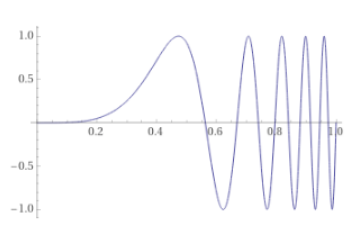 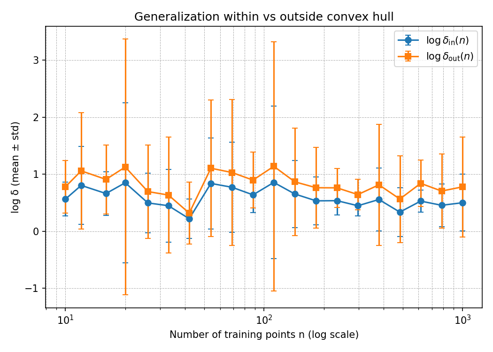

**Key Findings:**

| n | Train MSE | δ_in | δ_out | Interpretation |
|---|-----------|------|-------|----------------|
| 8 | 0.891 | 2.27 | 2.94 | Poor coverage |
| 32 | 0.583 | 1.32 | 1.49 | Improving interpolation |
| 128 | 0.437 | 1.48 | 1.72 | Good interpolation |
| 256 | 0.371 | 1.08 | 1.18 | Strong interpolation, weak extrapolation |

**Conclusions:**
- Networks interpolate well within the convex hull of training data
- Extrapolation fails dramatically outside training support
- "Overparameterization" enables good generalization *within* data distribution due to implicit regularization
- Generalization requires data coverage, not just model capacity

---

## ⚙️ Setup & Installation

### Requirements
```bash
python3 -m venv venv
source venv/bin/activate  # On Windows: venv\Scripts\activate
pip install --upgrade pip
pip install torch torchvision tqdm matplotlib numpy scikit-learn
pip install tokenizers  # For transformer project
```

### GPU Support
For CUDA-enabled training:
```bash
# Visit https://pytorch.org to get the appropriate wheel for your CUDA version
pip install torch torchvision --index-url https://download.pytorch.org/whl/cu118
```

---

## 🎓 Key Learnings

### Technical Insights

1. **Gradient Verification is Essential**
   - Finite difference checks caught multiple backprop bugs in NumPy implementations
   - Even small numerical errors compound through layers

2. **Framework Optimizations Matter**
   - PyTorch's optimized kernels provide both speed and numerical stability
   - Custom implementations educational but impractical for large-scale training

3. **Feature Engineering vs Deep Learning**
   - Gabor filters capture domain knowledge (orientation, frequency)
   - Deep networks learn similar features automatically given sufficient data
   - Hybrid approaches can be powerful

4. **Adversarial Fragility**
   - Modern CNNs achieve high accuracy but remain vulnerable to imperceptible perturbations
   - Input gradients reveal model sensitivity patterns
   - Robustness requires explicit design (adversarial training, certified defenses)

5. **Generalization Requires Coverage**
   - Overparameterized networks generalize well *within* training distribution
   - Extrapolation fails without explicit inductive biases
   - Data augmentation effectively expands training coverage

### Architectural Lessons

- **BatchNorm Placement**: BN → ReLU is standard; pre-activation variants exist for very deep networks
- **Residual Connections**: Essential for training deep networks (gradient flow)
- **Attention Mechanisms**: Causal masking enables autoregressive modeling; positional encodings inject sequence order
- **Regularization**: Weight decay on weights only; dropout between layers; data augmentation

---

## 🧬 Project 4: Variational Autoencoder for MNIST

### Objective
Implement and analyze a **Variational Autoencoder (VAE)** to study:
- Latent-variable generative modeling
- Variational inference via the ELBO
- Reconstruction–regularization tradeoffs
- Quantitative validation of generative models

The model is trained on a **binarized, downsampled MNIST dataset** and evaluated through reconstructions, prior sampling, and validation log-likelihood tracking.

---

### Dataset & Preprocessing

- Dataset: **MNIST**
- Training set:
  - 10,000 images total
  - Exactly **1,000 images per digit (0–9)**
- Preprocessing:
  - Downsampled from 28×28 → **14×14**
  - Binarized: pixel > 128 → 1, else 0
- Validation:
  - 100 images evaluated periodically during training

All images are flattened to 196-dimensional vectors.

---

### Model Architecture

#### Encoder \(q_u(z \mid x)\)
- Input: \(x \in \mathbb{R}^{196}\)
- Fully connected layers:
  - 196 → 128 (tanh)
  - 128 → 16 (linear)
- Output:
  - Mean \(\mu(x) \in \mathbb{R}^8\)
  - Log-variance \(\log\sigma^2(x) \in \mathbb{R}^8\)

The latent posterior is modeled as:
\[
q_u(z \mid x) = \mathcal{N}(\mu_u(x), \sigma_u(x)^2 I)
\]

---

#### Decoder \(p_v(x \mid z)\)
- Input: latent variable \(z \in \mathbb{R}^8\)
- Fully connected layers:
  - 8 → 128 (tanh)
  - 128 → 196 (sigmoid)
- Output:
  - Bernoulli parameters for each pixel

---

### Training Objective (ELBO)

The VAE maximizes the Evidence Lower Bound (ELBO):

\[
\mathcal{L}(u, v; x)
=
\mathbb{E}_{z \sim q_u(z|x)}[\log p_v(x|z)]
-
\mathrm{KL}(q_u(z|x)\,\|\,\mathcal{N}(0,I))
\]

- Reconstruction term: Bernoulli log-likelihood
- KL divergence: closed-form for diagonal Gaussians
- Expectation over latent variables approximated using **2 Monte Carlo samples**
- Optimization via the **reparameterization trick**

---

### Training & Validation Monitoring

#### ELBO Decomposition
The two ELBO components were logged **separately** as a function of optimizer updates:

- Reconstruction log-likelihood
- KL divergence to the prior

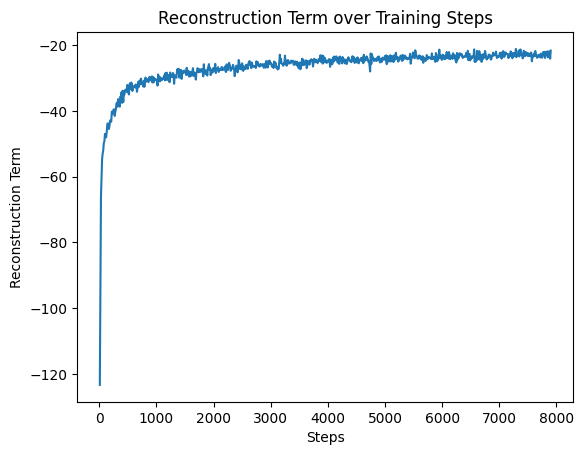

---

#### Training vs Validation Log-Likelihood
- Training reconstruction log-likelihood logged **after every weight update**
- Validation log-likelihood computed on **100 validation images every 100 updates**

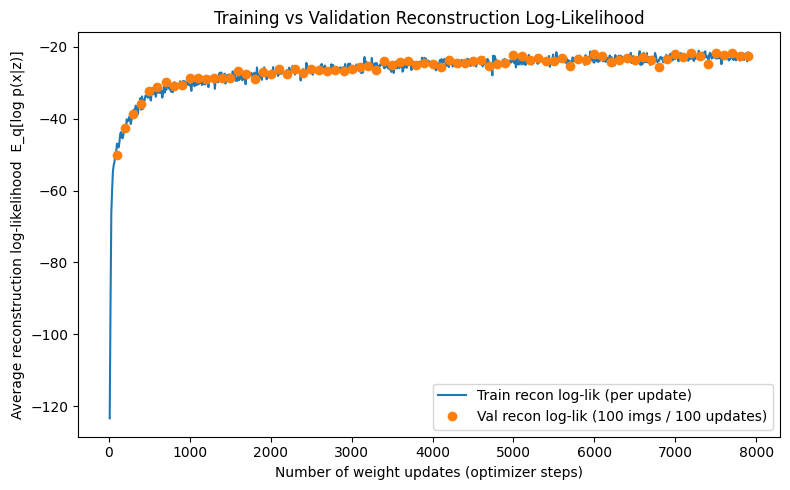

---

### Reconstruction Results

Eight MNIST images passed through the encoder and decoder.  
Each row shows the **original image (left)** and the **reconstructed output (right)**.


---

### Sampling from the Generative Model

New digits were generated by sampling:
\[
z \sim \mathcal{N}(0, I_8)
\]
and decoding with the trained decoder.


- Samples generated in mini-batches via a single decoder forward pass
- Decoder outputs Bernoulli probabilities (optionally thresholded)

---

---

## 🌫️ Project 5: Diffusion Models (DDPM) for MNIST Image Generation

### Objective
Implement a **Denoising Diffusion Probabilistic Model (DDPM)** from scratch to generate MNIST digits and study iterative generative modeling via noise removal.

This project builds directly on the VAE generative modeling exercise and addresses key VAE limitations such as blurry samples and latent bottlenecks by learning an **iterative denoising process in image space**.

---

### Dataset & Preprocessing

- Dataset: **MNIST**
- Image resolution: **28×28**
- Preprocessing:
  - Converted to tensors in \([0,1]\)
  - Rescaled to \([-1,1]\) for diffusion stability
- No binarization (diffusion operates on continuous values)

---

### Forward Process (Noising)

A fixed forward diffusion process gradually corrupts images with Gaussian noise:

\[
x_t = \sqrt{\bar{\alpha}_t} \, x_0 + \sqrt{1 - \bar{\alpha}_t} \, \epsilon,
\quad \epsilon \sim \mathcal{N}(0, I)
\]

- Linear \(\beta_t\) schedule
- \(T = 200\)–\(1000\) diffusion steps
- As \(t \to T\), \(x_t \to \mathcal{N}(0,I)\)

**Forward noising visualization:**
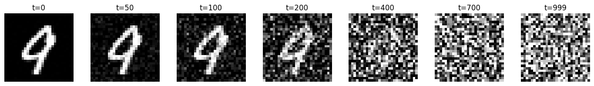

---

### Reverse Process (Denoising)

The generative model learns the reverse transition by predicting the noise added at each step:

\[
\epsilon_\theta(x_t, t) \approx \epsilon
\]

- Model: **UNet-based architecture**
- Inputs: noisy image \(x_t\) and timestep \(t\)
- Output: predicted noise \(\hat{\epsilon}\)
- Loss:
\[
\mathcal{L} = \mathbb{E}\left[\|\epsilon - \epsilon_\theta(x_t, t)\|^2\right]
\]

This formulation is equivalent to denoising score matching and yields stable training.

---

### Model Architecture

- Backbone: **Lightweight UNet (MNIST-scale)**
- Key components:
  - Downsampling and upsampling paths with skip connections
  - Residual convolutional blocks
  - Sinusoidal timestep embeddings injected at multiple layers
- Output: noise prediction with same shape as input image

---

### Training Dynamics

- Optimizer: AdamW
- Objective: MSE noise prediction loss
- Training performed on noised MNIST images at random timesteps

**Training loss curve:**
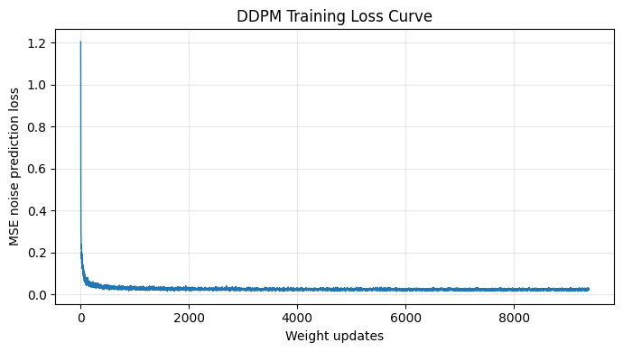

The loss decreases smoothly, indicating successful learning of the denoising task across noise levels.

---

### Sampling from the Model

Generation starts from pure Gaussian noise:

\[
x_T \sim \mathcal{N}(0, I)
\]

The model iteratively denoises the image using the learned reverse process until \(x_0\) is obtained.

**Final generated samples:**
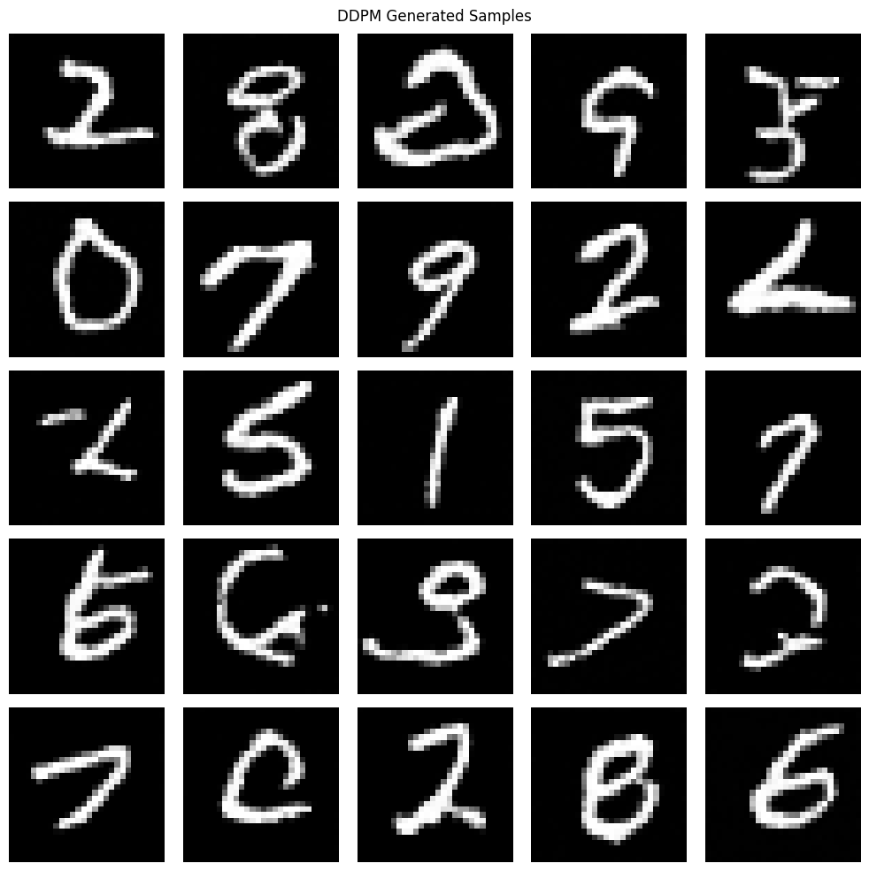

---

### Denoising Trajectory Visualization

To better understand the generative process, intermediate denoising steps were captured during sampling.

**Denoising progression from noise to digit:**


This visualization clearly shows structure emerging gradually from noise.

---

### Key Observations

- The forward process successfully maps data to near-pure Gaussian noise
- The UNet learns to denoise images across all noise levels
- Samples are sharper and more diverse than VAE-generated digits
- Generation is slower than VAEs but produces higher-quality results
- Diffusion models eliminate the need for a latent bottleneck

---

### Files (Project 5)

- `diffusion.py` — Noise scheduler and forward diffusion
- `unet.py` — UNet denoising model
- `train_ddpm.py` — Training loop and loss logging
- `sampling.py` — Reverse diffusion and visualization
- `outputs/`
  - `loss_plot.png`
  - `ddpm_sample.png`
  - `denoising.png`
  - `noising.png`

---

### Comparison with VAE (Project 4)

| Aspect | VAE | Diffusion |
|------|-----|-----------|
| Latent space | Explicit | None |
| Generation | One-shot | Iterative |
| Sample quality | Moderate | High |
| Training stability | Good | Excellent |
| Likelihood | Approximate | Variational |
| Sampling speed | Fast | Slow |

---

### Conclusion

This project demonstrates how diffusion models provide a powerful and stable framework for generative modeling by transforming generation into a sequence of denoising steps. Compared to VAEs, diffusion models achieve superior sample quality at the cost of increased sampling time, making them a strong baseline for modern image generation tasks.

---

### Key Observations

- Reconstruction log-likelihood improves steadily during training
- KL divergence stabilizes, indicating meaningful latent usage
- Generated samples resemble valid MNIST digits despite low latent dimensionality
- Validation log-likelihood tracks training early, diverging mildly with overfitting
- The latent space forms a smooth generative manifold

---

## 📚 References

### Papers
- Vaswani et al. (2017). *Attention is All You Need*. NeurIPS.
- He et al. (2016). *Deep Residual Learning for Image Recognition*. CVPR.
- Goodfellow et al. (2014). *Explaining and Harnessing Adversarial Examples*. ICLR.
- Zhang et al. (2017). *Understanding Deep Learning Requires Rethinking Generalization*. ICLR.
- Sennrich et al. (2016). *Neural Machine Translation of Rare Words with Subword Units*. ACL.

### Resources
- [PyTorch Documentation](https://pytorch.org/docs/)
- [HuggingFace Tokenizers](https://huggingface.co/docs/tokenizers/)
- [TorchVision Models](https://pytorch.org/vision/stable/models.html)
- [DDPM Paper](https://doi.org/10.48550/arXiv.2006.11239)

---

## 📧 Contact

**Kartik Virmani**

Feel free to reach out with questions or suggestions for improvements!

---

## 📄 License

This project is intended for educational purposes. All code is provided as-is for learning and research.